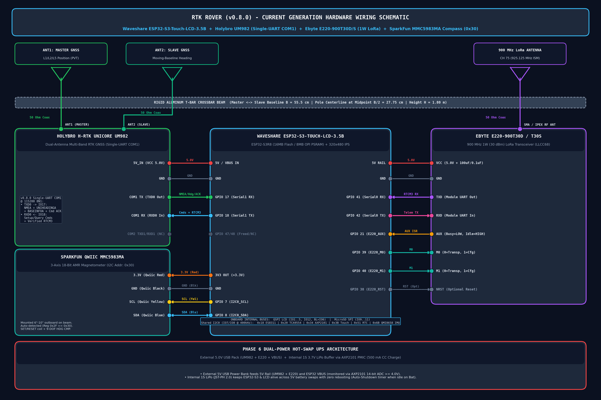

# RTK Rover & Smart Pole — System Hardware Wiring Schematics

**Document Version:** `v1.0.0`  
**Date:** November 7, 2026  
**Firmware Baseline:** `v0.8.0` (Phase 8 Single-UART `UM982 COM1` Consolidation + Auto-Detected `MMC5983MA` 9-DOF Compass)  

This document contains the complete system wiring schematics, RF antenna diagrams, and pin-by-pin interconnect tables for:
1. **Current Generation Prototype (`v0.8.0`):** **Waveshare ESP32-S3-Touch-LCD-3.5B** + **Holybro H-RTK Unicore UM982** (Single-UART `COM1`) + **Ebyte E220-900T30D / E220-900T30S** (1W 900 MHz LoRa) + **SparkFun Qwiic `MMC5983MA`** 3-Axis 18-Bit AMR Compass (`0x30`).
2. **Next-Generation Smart Pole:** **Waveshare ESP32-S3-Touch-LCD-3.49-V2** (`J3` 22-Pin Expansion Header + 18650 Battery) + **Discrete High-Side Switch (`NDP6020P` P-FET + `2N3904` NPN) & `MT3608` 5.0V Boost Stage** + **Holybro UM982** (Single-UART `COM1`) + **Ebyte E220-900T30D/S** + **SparkFun Qwiic `MMC5983MA` Compass (`0x30`)**.

---

## 1. Current Generation Prototype (`Waveshare ESP32-S3-Touch-LCD-3.5B`, Firmware `v0.8.0`)


*Figure 1: Complete Hardware & RF Antenna Wiring Schematic for the Current-Generation Waveshare `ESP32-S3-Touch-LCD-3.5B` Prototype (`v0.8.0` Single-UART `UM982 COM1` + Auto-Detected `MMC5983MA` Compass).*  
*(Vector SVG version: [`wiring_diagram_3_5B_v0_8_0.svg`](wiring_diagram_3_5B_v0_8_0.svg))*

### 1.1 Complete Pin-by-Pin Interconnect Table (`ESP32-S3-Touch-LCD-3.5B`)

| Peripheral Module | Module Pin / Port | Direction | `ESP32-S3-Touch-LCD-3.5B` Pin | Signal / Protocol Specification |
| :--- | :--- | :---: | :--- | :--- |
| **Holybro UM982 GNSS** | `5V_IN` (`VCC`) | $\longleftarrow$ | `5V` / External USB 5V Rail | `+5.0 V` DC Supply (`~320 mA` incl. active LNA bias) |
| **Holybro UM982 GNSS** | `GND` | $\longleftrightarrow$ | `GND` | Common System Ground |
| **Holybro UM982 GNSS** | **`COM1 TX` (`TXD0`)** | $\longrightarrow$ | **`GPIO 17` (`Serial1 RX`)** | `115200 8N1` — `NMEA` (`GGA`, `RMC`, `GST`, `GSV`, `GGAH`) + `#UNIHEADINGA` + `#BASEINFOA` + Command Responses (`VERSIONA`, `MODE`, `CONFIG`, `LOGLIST`) |
| **Holybro UM982 GNSS** | **`COM1 RX` (`RXD0`)** | $\longleftarrow$ | **`GPIO 18` (`Serial1 TX`)** | `115200 8N1` — Multiplexed ASCII Setup/Query Commands + `CRC24Q`-Verified Binary `RTCM3.x` Corrections (`1006, 1074, 1084, 1094, 1230`) |
| **Holybro UM982 GNSS** | `COM2 TX/RX` (`TXD1/RXD1`) | — | **`GPIO 47 / 48` (Freed / NC)** | **Disconnected in `v0.8.0`** (saves 2 wires & ~6 KB internal `DRAM0`) |
| **Holybro UM982 GNSS** | **`ANT1 (MASTER)` MMCX/SMA** | $\longleftrightarrow$ | **Master GNSS Antenna** | $50\,\Omega$ Coax to L1/L2/L5 Master Antenna (Position / PVT) |
| **Holybro UM982 GNSS** | **`ANT2 (SLAVE)` MMCX/SMA** | $\longleftrightarrow$ | **Slave GNSS Antenna** | $50\,\Omega$ Coax to L1/L2/L5 Slave Antenna (Moving-Baseline Heading, $B = 55.5\text{ cm}$) |
| **Ebyte E220-900T30D/S** | `VCC` | $\longleftarrow$ | `5V` / External USB 5V Rail | `+5.0 V` DC Supply (with local `100 uF` electrolytic + `0.1 uF` ceramic decoupling) |
| **Ebyte E220-900T30D/S** | `GND` | $\longleftrightarrow$ | `GND` | Common System Ground |
| **Ebyte E220-900T30D/S** | **`TXD` (Module Out)** | $\longrightarrow$ | **`GPIO 41` (`Serial0 RX`)** | `115200 8N1` (Mode 0 RTCM3 Downlink + RSSI Reply) / `9600 8N1` (Mode 3 Config) |
| **Ebyte E220-900T30D/S** | **`RXD` (Module In)** | $\longleftarrow$ | **`GPIO 42` (`Serial0 TX`)** | `115200 8N1` (45-Byte Uplink Telemetry + Rate-Switch Req + RSSI Query) |
| **Ebyte E220-900T30D/S** | **`AUX`** | $\longrightarrow$ | **`GPIO 21` (ISR Input)** | Hardware Edge Interrupt (`HIGH` = Idle/Ready, `LOW` = RF/UART Busy) |
| **Ebyte E220-900T30D/S** | **`M0`** | $\longleftarrow$ | **`GPIO 39` (Output)** | Mode Select Bit 0 (`0` = Mode 0 Transparent, `1` = Mode 3 Sleep/Config) |
| **Ebyte E220-900T30D/S** | **`M1`** | $\longleftarrow$ | **`GPIO 40` (Output)** | Mode Select Bit 1 (`0` = Mode 0 Transparent, `1` = Mode 3 Sleep/Config) |
| **Ebyte E220-900T30D/S** | `NRST` *(Optional)* | $\longleftarrow$ | `GPIO 38` (Output) | Optional Hardware Reset |
| **Ebyte E220-900T30D/S** | **`SMA / IPEX RF Port`** | $\longleftrightarrow$ | **900 MHz LoRa Antenna** | $50\,\Omega$ Coax to 900 MHz ISM Antenna (`CH 75 = 925.125 MHz`) |
| **SparkFun `MMC5983MA`** | `3.3V` (Qwiic Red) | $\longleftarrow$ | **`3V3` (`+3.3 V` Out)** | `+3.3 V` Regulated Supply (`< 1 mA` average) |
| **SparkFun `MMC5983MA`** | `GND` (Qwiic Black) | $\longleftrightarrow$ | **`GND`** | Common System Ground |
| **SparkFun `MMC5983MA`** | **`SCL` (Qwiic Yellow)** | $\longleftarrow$ | **`GPIO 7` (`I2C0_SCL`)** | `400 kHz` Shared I2C0 Clock (with 18-clock GPIO bus-clear & `i2c_bsp_lock()`) |
| **SparkFun `MMC5983MA`** | **`SDA` (Qwiic Blue)** | $\longleftrightarrow$ | **`GPIO 8` (`I2C0_SDA`)** | `400 kHz` Shared I2C0 Data (I2C Address `0x30`, Auto-Detected via `Reg 0x2F == 0x30`) |

---

## 2. Next-Generation Smart Pole (`Waveshare ESP32-S3-Touch-LCD-3.49-V2`, 1" Aluminum Beam)


*Figure 2: Complete Hardware, Discrete `NDP6020P`/`MT3608` Power Stage, and RF Antenna Wiring Schematic for the Next-Generation `Waveshare ESP32-S3-Touch-LCD-3.49-V2` Smart Pole.*  
*(Vector SVG version: [`wiring_diagram_3_49_V2_smart_pole.svg`](wiring_diagram_3_49_V2_smart_pole.svg))*

### 2.1 Complete `J3` 22-Pin Header & Power Stage Interconnect Table (`ESP32-S3-Touch-LCD-3.49-V2`)

| `J3` Header Pin | `3.49-V2` Signal | Direction | Connected Subsystem / Pin | Signal / Electrical Specification |
| :--- | :--- | :---: | :--- | :--- |
| **`J3 Pin 1`** | **`VBAT`** (`3.5V–4.2V`) | $\longrightarrow$ | **`NDP6020P` Source (Pin 3)** & **`R1` (`10 kΩ`)** | Unswitched 18650 Li-Ion battery positive rail feeding the high-side P-FET switch |
| **`J3 Pin 2`** | **`3V3`** (`+3.3V` Switched) | $\longrightarrow$ | **`R2` (`10 kΩ`) $\to$ `2N3904` Base** & **`MMC5983MA` `3.3V`** | Active-HIGH when board is ON (`+3.3 V`), `0 V` when OFF (`0.00 uA` off-state leak) |
| **`J3 Pins 3, 21, 22`** | **`GND`** | $\longleftrightarrow$ | **Common Star Ground** | Common ground for `2N3904` Emitter, `MT3608`, `UM982`, `E220`, and `MMC5983MA` |
| **`J3 Pin 4`** | **`GPIO 4` (`ADC_INT`)** | Internal | **Onboard `VBAT` Divider (`200k/100k`)** | `3.0x` hardware voltage divider for live 18650 battery voltage & low-battery SD flush |
| **`J3 Pin 5`** | **`GPIO 15` (`Serial1 RX`)** | $\longleftarrow$ | **Holybro UM982 `COM1 TX` (`TXD0`)** | `115200 8N1` — `NMEA` + `#UNIHEADINGA` + `#BASEINFOA` + Command Responses |
| **`J3 Pin 6`** | **`GPIO 16` (`Serial1 TX`)** | $\longrightarrow$ | **Holybro UM982 `COM1 RX` (`RXD0`)** | `115200 8N1` — Multiplexed ASCII Commands + `CRC24Q`-Verified `RTCM3.x` Corrections |
| **`J3 Pin 9`** | `GPIO 6` | — | **Freed / Spare GPIO** | Freed by Phase 8 Single-UART `UM982 COM1` consolidation |
| **`J3 Pin 7`** | **`GPIO 43` (`TXD0`)** | $\longrightarrow$ | **Ebyte E220 `RXD` (Module In)** | `115200 8N1` (Mode 0 Uplink Telemetry / RSSI Query) / `9600 8N1` (Mode 3 Config) |
| **`J3 Pin 8`** | **`GPIO 44` (`RXD0`)** | $\longleftarrow$ | **Ebyte E220 `TXD` (Module Out)** | `115200 8N1` (Mode 0 RTCM3 Downlink + RSSI Reply) / `9600 8N1` (Mode 3 Config) |
| **`J3 Pin 10`** | **`GPIO 48` (ISR Input)** | $\longleftarrow$ | **Ebyte E220 `AUX`** | Hardware Edge Interrupt (`HIGH` = Idle/Ready, `LOW` = Busy) |
| **`J3 Pin 15`** | **`GPIO 2` (Output)** | $\longrightarrow$ | **Ebyte E220 `M0`** | Mode Select Bit 0 (`0` = Mode 0 Transparent, `1` = Mode 3 Sleep/Config) |
| **`J3 Pin 16`** | **`GPIO 1` (Output)** | $\longrightarrow$ | **Ebyte E220 `M1`** | Mode Select Bit 1 (`0` = Mode 0 Transparent, `1` = Mode 3 Sleep/Config) |
| **`J3 Pin 17`** | **`GPIO 18` (`I2C_SCL`)** | $\longrightarrow$ | **SparkFun `MMC5983MA` `SCL` (Yellow)** | `400 kHz` I2C0 Clock to outboard beam compass (`6"`–`10"` along aluminum tube) |
| **`J3 Pin 18`** | **`GPIO 17` (`I2C_SDA`)** | $\longleftrightarrow$ | **SparkFun `MMC5983MA` `SDA` (Blue)** | `400 kHz` I2C0 Data to outboard beam compass (`0x30`, shared with `0x6B` IMU & `0x51` RTC) |
| **`J3 Pin 11`** | `GPIO 47` | $\longleftarrow$ | **SparkFun `MMC5983MA` `INT`** *(Optional)* | Optional hardware Data-Ready interrupt from `MMC5983MA` |

### 2.2 Discrete High-Side Power Switch (`NDP6020P` + `2N3904`) & `MT3608` `+5.00V` Boost Schematic

```text
J3 Pin 1 (VBAT: 3.5V - 4.2V from Rear 18650 Holder)
  │
  ├──────────────────────┬────────────────────────► NDP6020P Pin 3 (SOURCE)
  │                      │
  │                    [R1: 10 kOhm] (Holds Gate at VBAT when OFF -> 0.00 uA leak)
  │                      │
  │                      ├────────────────────────► NDP6020P Pin 1 (GATE)
  │                      │
  │                    2N3904 Collector (Pin 3)
  │                      │
J3 Pin 2 (3V3) ──[R2: 10 kOhm]──► 2N3904 Base (Pin 2)
  │                      │
  │                    2N3904 Emitter (Pin 1) ────► J3 Pin 3 (GND)
  │
  └──► SparkFun MMC5983MA 3.3V (Red Wire)

NDP6020P Pin 2 (DRAIN / Center Pin & Tab)
  │
  └──► Switched VBAT ──► [MT3608 VIN+] ===> [MT3608 VOUT+ (+5.00V)] ──┬──► Holybro UM982 5V_IN
                                                                      ├──► Ebyte E220-900T30D/S VCC (5.0V)
                                                                      └──► [100uF-220uF + 0.1uF Caps] ──► GND
```

---

## 3. System Power Budget, `MT3608` Boost Analysis & Battery Runtime Estimates

When running untethered from a single-cell `1S` Li-Ion/LiPo battery pack (`3.7 V` nominal) via the high-side switched **`MT3608`** `+5.00 V` boost stage (`VBAT` -> `NDP6020P` -> `MT3608` -> `UM982` & `E220`, with controller/display/sensors powered via the `AXP2101` PMIC), total battery current equals the sum of the reflected `5.0 V` boost load and the `3.3 V / VSYS` controller load.

### 3.1 Subsystem Current & Power Breakdown (`VBAT = 3.7 V` Nominal)

| Subsystem / Rail | Supply Source | Operating Load (`@ Rail`) | Est. `VBAT` Draw (`@ 3.7 V`) | Basis / Notes |
| :--- | :--- | :---: | :---: | :--- |
| **Holybro H-RTK `UM982`** | `MT3608` `+5.0 V` | `320–350 mA` (`1.60–1.75 W`) | **`~510–560 mA`** | Dual-antenna receiver + dual LNA bias (`~320 mA` schematic typ; `~350 mA` Holybro spec; core `180 mA` typ / `300 mA` max @ `3.3 V`) |
| **Ebyte `E220-900T30S`** | `MT3608` `+5.0 V` | `~25–40 mA` avg (`0.13–0.20 W`) | **`~40–75 mA`** | `~17 mA` RX continuous (`14–18 mA`) + `610–850 mA` peak TX bursts (`~50–160 ms` per `5 s` uplink = `1%–3.2%` duty @ `4.8k`–`19.2k`) |
| **`MT3608` Boost Subtotal** | `~85%` typ eff (`83–88%`) | **`345–390 mA` (`~375 mA` typ)** | **`~596 mA` typ** (`530–635 mA`) | $P_{\text{bat}} = P_{5\text{V}} / \eta_{\text{boost}}$; typical `1.88 W / (0.85 * 3.7 V)` |
| **ESP32-S3 + PSRAM + `SD_MMC`** | `AXP2101` `DCDC1` (`3.3 V`) | `~95–130 mA` (`Wi-Fi OFF`) | **`~95–130 mA`** | `240 MHz` dual-core Modem-sleep (`66–108 mA` datasheet) + QSPI/SD logging; **add `~100–140 mA` avg if Wi-Fi AP/STA is ON** |
| **3.5" `320x480` IPS LCD + Touch** | `VSYS` / `AXP2101` (`80%` PWM) | `~85–110 mA` (`80%` default) | **`~85–110 mA`** | Backlight (`R3 = 6.8 Ω` LED chain + driver) + `AXS15231B`; drops to `~45–55 mA` when dimmed to `40%` |
| **10DOF / IMU / RTC / Audio** | `3V3` (`AXP2101`) | `~2–5 mA` total | **`~2–5 mA`** | `SEN0696` (`BMI323` `0.79 mA` + `BMM350` `0.20 mA` + `BMP581` `1.3 uA`) / `MMC5983MA` (`< 1 mA`) + `QMI8658` / `PCF85063` |
| **Controller/Display Subtotal** | `AXP2101` + `VSYS` | **`~180–240 mA`** (`~210 mA` typ) | **`~210 mA` typ** | `Wi-Fi OFF`, `80%` backlight |
| **Total Rover System Load** | **`1S` Li-Ion/LiPo (`3.7 V`)** | — | **`~806 mA` (`~3.0 W`) typ** | Range: `~675 mA` (`2.5 W` Eco) to `~1,005 mA` (`3.7 W` Heavy) |

### 3.2 Expected Battery Runtime (`3,000 mAh` vs. `10,000 mAh`)

Practical estimates below apply an **`85%–90%` usable capacity factor** to account for under-load battery voltage sag reaching the `MT3608` / `AXP2101` dropout knee (`~3.4 V`), alongside the `100%` nominal theoretical runtime:

| Operating Profile | Est. `VBAT` Draw (`@ 3.7 V`) | **3,000 mAh (`11.1 Wh`)** *(85–90% usable)* | **10,000 mAh (`37.0 Wh`)** *(85–90% usable)* |
| :--- | :---: | :---: | :---: |
| **Eco Survey** (`40%` brightness, `Wi-Fi OFF`, `9.6k/19.2k`) | **`~675 mA`** (`2.5 W`) | **~3.8 – 4.0 hrs** *(4.4 hrs nominal)* | **~12.6 – 13.3 hrs** *(14.8 hrs nominal)* |
| **Typical Field** (`80%` brightness, `Wi-Fi OFF`, `4.8k`, SD logs ON) | **`~806 mA`** (`3.0 W`) | **~3.2 – 3.4 hrs** *(3.7 hrs nominal)* | **~10.6 – 11.2 hrs** *(12.4 hrs nominal)* |
| **Heavy Load** (`100%` brightness, **`Wi-Fi ON`**, `4.8k`, SD logs ON) | **`~1,005 mA`** (`3.7 W`) | **~2.5 – 2.7 hrs** *(3.0 hrs nominal)* | **~8.5 – 9.0 hrs** *(10.0 hrs nominal)* |

*(High internal resistance in a single `3,000 mAh` pouch cell or thin `JST MX1.25` leads can cause slightly earlier low-voltage cutoff on `E220` TX bursts, pushing practical pouch runtime toward `~2.8–3.2 hrs`; a `10,000 mAh` pack reduces per-cell stress by $>3\times$.)*

### 3.3 Battery-Only Hardware & Firmware Checklist

1. **Idle Auto-Shutdown Timer (`auto_shutdown_battery_min`):** Defaults to **`5` minutes** without touchscreen input when running on battery (`settings_manager.cpp`). Set `"auto_shutdown_battery_min": 0` in `/settings.json` for unattended battery field walks so `axp2101_bsp_power_off()` does not fire mid-traverse.
2. **Instantaneous `E220` TX Surges & `925 MHz` RF Noise Verification:** Each `4.8k` uplink burst pulls `~0.95–1.20 A` peak at `5.0 V` (`~1.8–2.5 A` peak from `VBAT` through the `MT3608`). Place `>= 470 uF` low-ESR electrolytic + `0.1 uF` ceramic decoupling right across `MT3608` `VIN`/`VOUT`, use heavy-gauge battery leads (avoid small `MX1.25` pigtails where practical), and verify Tile 4 `Noise` stays clean (`<= -92 dBm`) to confirm the `MT3608` switching inductor does not couple `925 MHz` ripple into the `E220` (recall `test/_052` saw `~9 dB` lower RF noise on internal battery than on external `USB` cabling).
3. **Recharge Time via Onboard `AXP2101` (`500 mA` Cap):** `axp2101_bsp.c` configures `REG 0x62 = 0x0B` (**`500 mA`** constant-current limit). Charging via USB-C takes **~7 hrs** for `3,000 mAh` and **~20+ hrs** for `10,000 mAh` (prefer an external charger for `10,000 mAh` packs).
